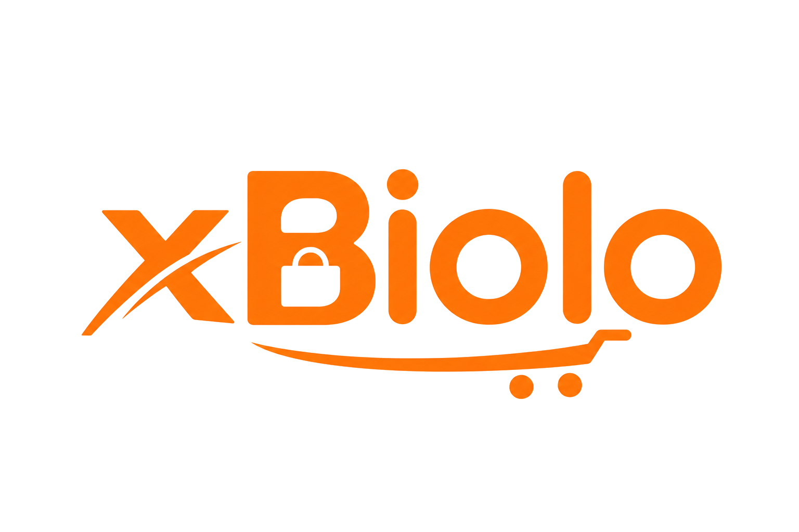

<div align="center">
  

  **Catálogo digital com finalização via WhatsApp**
  
  [](https://github.com/Adyllsxn/xBiolo)
  [](./docs/STATUS.md)
  [](LICENSE)
  
  <br/>
</div>

---

## **📖 SOBRE O PROJETO**

> O **xBiolo** plataforma de catálogo digital para venda de produtos com integração via WhatsApp.

### 🎯 Funcionalidades

```markdown
✅ Catálogo organizado por categorias
✅ Carrinho de compras (sacolinha)
✅ Finalização via WhatsApp
✅ Dashboard administrativo completo
```
---


## **📚 DOCUMENTAÇÃO**

| Documento | Descrição |
|-----------|------------|
| [🛠️ Tecnologias](./docs/TECH.md) | Stack tecnológica utilizada no projeto |
| [🚀 Setup](./docs/SETUP.md) | Como instalar e executar o projeto |

---

## **📸 DEMO**


<div align="center">
  <table>
    <tr>
      <td align="center" width="50%">
        
        <br />
        <b>🏠 Catálogo do Cliente</b>
      </td>
      <td align="center" width="50%">
        
        <br />
        <b>📊 Dashboard Administrativo</b>
      </td>
    </tr>
  </table>
</div>

---

## **📄 LICENÇA**

> Este projeto está sob a licença MIT, o que significa que é de código aberto e pode ser utilizado livremente para fins académicos e comerciais, desde que mantidos os créditos.

```markdown
📚 Código aberto (open source)
✅ Livre para uso académico
🤝 Contribuições são bem-vindas
```
---
